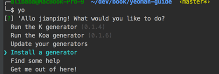
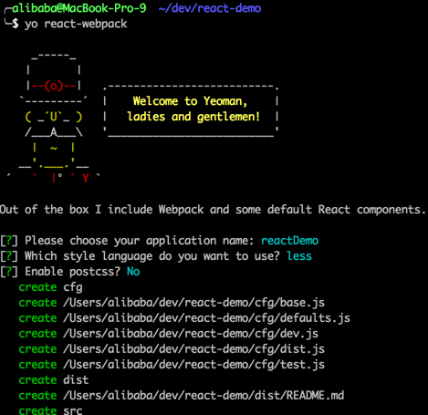
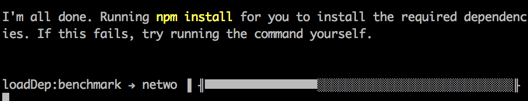

# Yeoman 的简单使用

### 安装yeoman

    npm install -g yo
 
安装成功后，运行命令 yo ：
   
   

会出现问询列表，您曾安装过的 generator （yoeman 的概念，工程构建器） 会出现在这个列表，比如 run then xx generator (x.x.x)。

可以选择安装一个全新的 generator，“Install a generator”，我们安装一个 react 工程构建器，[generator-react-webpack](https://github.com/newtriks/generator-react-webpack)。

国内网速不理想，可以手动安装 generator ：

    npm install -g generator-react-webpack

generator 安装成功后，会向 yo 注册子命令：yo react-webpack，命名名就是模块名（去掉 generator- 前缀）。
  

### 生成工程目录

创建（或打开）你的工程根目录，比如 react-demo ，然后运行命令：

    yo react-demo
    
yeoman 的 generator 带有问询模块（后面一章将编写 generator 时，会说明如何创建问询）。

按照问询输入或选择后，yoeman 就会创建 react 工程的初始目录结构。

一切如此简单，你不需要再手动创建工程目录，也不需要再费事的google搜索下需要的框架，然后再下载，解压到工程目录。

使用一行命令，然后就立马进入coding状态！这就是yeoman提高前端工作的地方，而且可以保证团队得其他同学的工程规范性。

生成完成后，generator-react-webpack 还会自动安装依赖模块，相当于调用了 npm install 。

工程调试、编译等工作，generator-react-webpack 都已经预制写好配置，详细请看 generator-react-webpack 的文档，这部分就不属于 yoeman 的工作了。

