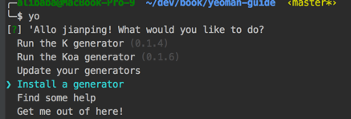
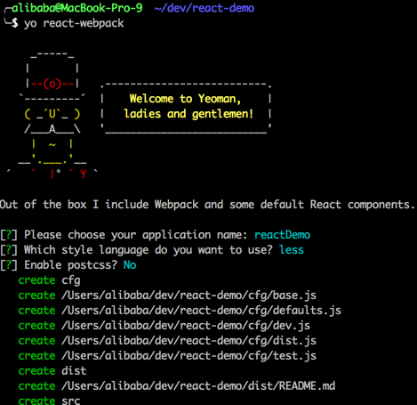
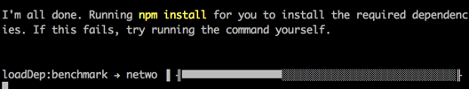

# Yeoman 简介

很难使用一句话来表述Yeoman用途，因为Yeoman其实是三个工具的集合：[YO](http://yeoman.io/)、[GRUNT](https://github.com/gruntjs/grunt)、[BOWER](http://bower.io/)，所以需要先解释下这三个工具的用途。

*   [YO](http://yeoman.io/)：Yeoman核心工具，项目工程依赖目录和文件生成工具，项目生产环境和编译环境生成工具
*   [GRUNT](https://github.com/gruntjs/grunt)：grunt前端构建工具，jquery就是使用这个工具打包的
*   [BOWER](http://bower.io/)：Web开发的包管理器，概念上类似npm，npm专注于nodeJs模块，而bower专注于CSS、JavaScript、图像等前端相关内容的管理

（2016年补充：grunt已经被 gulp 取代，而 bower 已经死掉，败于 npm ，但 yo 成为了脚手架工具的标准。）

info 有篇yeoman的介绍文章：[《Yeoman：构建漂亮Web应用的工具和框架》](http://www.infoq.com/cn/news/2012/09/yeoman)，标题对yeoman的定义不算准确。

**yeoman定义了一套用于提高前端工程师效率的规范工作流工具。**

效率和规范是yeoman的核心诉求，后面明河讲解yeoman使用场景时会说到，yeoman是如何提高你的项目效率。

打个比喻：如果前端项目是工厂的产品的话，yeoman就像工厂的流水线，标准化、傻瓜化、批量化产品生产，生产过程乏味了，但效率提高了。

## 什么场景下使用yeoman？

假设接到一个项目：火车票订票系统，代码层面，前几天思考的问题如下：

* 1.项目目录该如何规划？
* 2.使用什么类库来支撑系统开发？
* 3.生产环境如何搭建（比如很多前端的生产环境是基于php，也有基于NodeJs）
* 4.编译环境如何搭建（编译环境其实应该归到生产环境中，但前端很多人使用coffeescript/less/sass等，所以需要编译环境）
* 5.单元测试环境如何搭建？
* 6.调试环境如何搭建（本地代理远程assets等）
* 7.开发完毕后打包部署如何处理？

我相信多数前端在项目 coding 前肯定都会碰上类似的问题，你是花半天、1天、2天解决？

假如你是多人合作呢？问题更严重，如何保持团队环境和代码规范的一致性？教团队成员装依赖？配置工具？大费口舌告之规范？

每做一个项目，你都会遇到相同问题，再重复一遍？

亲累不？

**用yeoman！1 行命名，15秒进入coding状态！**

## yeoman的简单使用

### 安装yeoman

    npm install -g yo
 
安装成功后，运行命令 yo ：
   
   

会出现问询列表，您曾安装过的 generator （yoeman 的概念，工程构建器） 会出现在这个列表，比如 run then xx generator (x.x.x)。

可以选择安装一个全新的 generator，“Install a generator”，我们安装一个 react 工程构建器，[generator-react-webpack](https://github.com/newtriks/generator-react-webpack)。

国内网速不理想，可以手动安装 generator ：

    npm install -g generator-react-webpack

generator 安装成功后，会向 yo 注册子命令：yo react-webpack，命名名就是模块名（去掉 generator- 前缀）。
  

### 生成工程目录

创建（或打开）你的工程根目录，比如 react-demo ，然后运行命令：

    yo react-demo
    
yeoman 的 generator 带有问询模块（后面一章将编写 generator 时，会说明如何创建问询）。

按照问询输入或选择后，yoeman 就会创建 react 工程的初始目录结构。

一切如此简单，你不需要再手动创建工程目录，也不需要再费事的google搜索下需要的框架，然后再下载，解压到工程目录。

使用一行命令，然后就立马进入coding状态！这就是yeoman提高前端工作的地方，而且可以保证团队得其他同学的工程规范性。

生成完成后，generator-react-webpack 还会自动安装依赖模块，相当于调用了 npm install 。

工程调试、编译等工作，generator-react-webpack 都已经预制写好配置，详细请看 generator-react-webpack 的文档，这部分就不属于 yoeman 的工作了。

## Yeoman特性总结

* 快速创建骨架应用程序——使用可自定义的模板（例如：HTML5、Boilerplate、Twitter Bootstrap等）、AMD（通过RequireJS）以及其他工具轻松地创建新项目的骨架。
* 自动编译 CoffeeScrip 和 Compass ——在做出变更的时候，Yeoman的LiveReload监视进程会自动编译源文件，并刷新浏览器，而不需要你手动执行。
* 自动完善你的脚本——所有脚本都会自动针对jshint（软件开发中的静态代码分析工具，用于检查JavaScript源代码是否符合编码规范）运行，从而确保它们遵循语言的最佳实践。
* 内建的预览服务器——你不需要启动自己的HTTP服务器。内建的服务器用一条命令就可以启动
* 非常棒的图像优化——Yeoman使用OptPNG和JPEGTran对所有图像做了优化，从而你的用户可以花费更少时间下载资源，有更多时间来使用你的应用程序。
* 生成AppCache清单——Yeoman会为你生成应用程序缓存的清单，你只需要构建项目就好
* “杀手级”的构建过程——你所做的工作不仅被精简到最少，让你更加专注，而且Yeoman还会优化所有图像文件和HTML文件、编译你的CoffeeScript和Compass文件、生成应用程序的缓存清单，如果你使用AMD，那么它还会通过r.js来传递这些模块。这会为你节省大量工作
* 集成的包管理——Yeoman让你可以通过命令行（例如，yeoman搜索查询）轻松地查找新的包，安装并保持更新，而不需要你打开浏览器
* 对ES6模块语法的支持——你可以使用最新的ECMAScript 6模块语法来编写模块。这还是一种实验性的特性，它会被转换成eS5，从而你可以在所有流行的浏览器中使用编写的代码
* PhantomJS 单元测试——你可以通过PhantomJS轻松地运行单元测试。当你创建新的应用程序的时候，它还会为你自动创建测试内容的骨架
